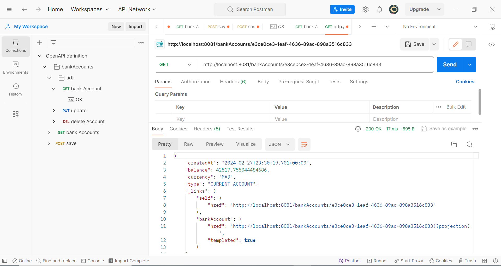

<h1>Compte Rendu</h1>

<ul>
    <li>
        1. Créer un projet Spring Boot avec les dépendances Web, Spring Data JPA, H2, Lombok
    </li>
</ul>

<ul>
    <li>
        2. Créer l'entité JPA Compte
    </li>
</ul>

<ul>
    <li>
        3. Créer l'interface CompteRepository basée sur Spring Data
    </li>
</ul>

<ul>
    <li>
        4. Tester la couche DAO
    </li>
</ul>

<ul>
    <li>
        5. Créer le Web service Restfull qui permet de gérer des comptes
    </li>
</ul>

<ul>
    <li>
        6. Tester le web micro-service en utilisant un client REST comme Postman
    </li>
</ul>

<ul>
    <li>
        7. Générer et tester le documentation Swagger de des API Rest du Web service
    </li>
</ul>

<ul>
    <li>
        8. Exposer une API Restful en utilisant Spring Data Rest en exploitant des projections
    </li>
</ul>

<ul>
    <li>
        9. Créer les DTOs et Mappers
    </li>
</ul>

====> DTO

====> Mapper

<ul>
    <li>
        10. Créer la couche Service (métier) et du micro service
    </li>
</ul>

